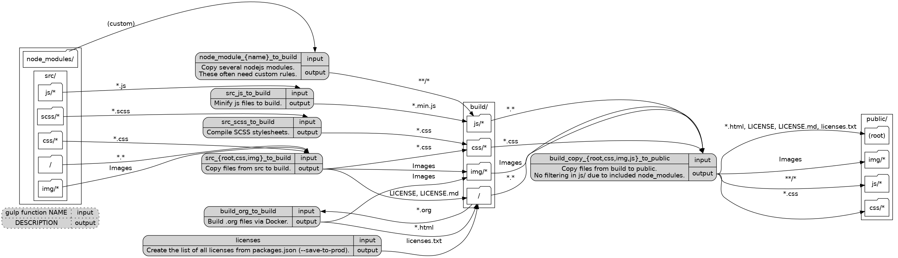

- [Overview](#org8060102)
  - [Important targets](#org5c3c4a0)
    - [`gulp publish` - build `public/`](#org979023c)
    - [`gulp serve` - development webserver with watch](#org52f0006)
    - [`gulp package` - create a ZIP](#org947dfd8)
    - [`gulp clean` - clean `build/` and `public/`](#orgc16c026)
  - [Design decisions](#org42f41fe)
  - [Directory layout](#orgda389d1)
    - [Flow between folders](#orge6a15a3)
  - [Configuration in `packages.json`](#org606ffa6)
  - [Edit the presentation](#orgab560c1)
  - [Required tools for building](#org07f6f6c)
  - [Tools used by the author](#org2f66e2e)
    - [`gulp` for building](#org41d2117)
    - [`reveal.js` as presentation framework](#orgfbb06dd)
    - [`emacs` with `org-mode`, `org-babel`, `org-re-reveal` for writing/exporting](#org2800f69)
    - [`Docker` for transforming `org` to `html`](#orgc6656cb)
- [Building this document](#orgf591f95)
- [Building `gulpfile.js`](#org1e47fea)
  - [Red Tape](#org37b77d6)
    - [Make package.json available](#orgab7231b)
    - [Setup plugins for gulpfile](#org40f2c4d)
    - [Configure Plugins](#org611e2ac)
  - [Custom Functions](#org152c77c)
  - [Folders](#orgd8e59d8)
    - [src/](#orgafed90b)
    - [node\_modules/](#org3b536d2)
    - [build/](#org4a0c862)
    - [public/](#org5a20419)
  - [Utility Functions](#orgf53bb05)
    - [serve](#orgabd1131)
    - [clean](#orgf0a1a19)


<a id="org8060102"></a>

# Overview

This (rather lengthy) file describes the build process and is used to generate the [gulpfile](../gulpfile.js).


<a id="org5c3c4a0"></a>

## Important targets

The final version will be published into the `public/` directory. Calling `gulp` (or `gulp default`) will build the whole presentation.

**It is important that the presentation is viewed via http(s)** since some JS libraries will not correctly work when served via the file system. [`gulp serve`](#org52f0006) starts a small webserver for that.


<a id="org979023c"></a>

### `gulp publish` - build `public/`

`gulp` or `gulp publish` will update `public/` to the latest result (see [here](#org994b1f7)).

[`gulp clean`](#orgc16c026) is **not** called as a part of publish.


<a id="org52f0006"></a>

### `gulp serve` - development webserver with watch

`gulp serve` will start a small webserver to view the results (via [gulp-serve](https://www.npmjs.com/package/gulp-serve)).

The task is defined [here](#orgabd1131).


<a id="org947dfd8"></a>

### TODO `gulp package` - create a ZIP

`gulp package` will create a ZIP file of `public/**/*`.


<a id="orgc16c026"></a>

### `gulp clean` - clean `build/` and `public/`

`gulp clean` will delete all build outputs.

The task is defined [here](#orgf0a1a19).


<a id="org42f41fe"></a>

## Design decisions

The whole process serves the simple matter of *creating a presentation*. That means neither bandwitdh nor page load speed are a primary consideration.

These are the primary design goals, from more general to more specific:

-   **Get the Job Done:** In the end the result in `public/` matters.
-   **Ease of Use:** The whole process must be easy to use with a [minimum set of required tools](#org07f6f6c).
-   **Automated Build:** The whole process needs to be automated.
-   **Support for `org-mode`:** This was the trigger. I wanted to use [emacs](https://www.gnu.org/software/emacs/) with [org-mode](https://orgmode.org/), [org-babel](https://orgmode.org/worg/org-contrib/babel/), and [org-re-reveal](https://gitlab.com/oer/org-re-reveal) for writing slides.
-   **Reuseable:** The whole system should be reusable across multiple presentations. *Ideally* a new presentation just needs some bootstrap (repository) and *content*.
-   **One Pipeline Per File:** Each file *should* only be modified (e.g. minify) in exactly *one* pipeline. Changing files in multiple pipelines makes it difficult to figure out *where* things happen.
-   **Configuration in [package.json](../package.json):** Ideally (see *Reuseable*) a new presentation only needs changes in [package.json](../package.json) and [index.org](../src/index.md).


<a id="orgda389d1"></a>

## Directory layout

The directory layout is quite simple: Files are moved from `{src, node_modules}` to `build`. In `build` files are generated (e.g. `.org` &#x2013;> `.html`) and then copied to `public`.

-   **node\_modules/:** [Modules](../package.json) installed via [npm](https://www.npmjs.com/). Copied to `build/js` via specific targets. (see [node\_modules/](#org3b536d2))
-   **src/:** Source files (*read-only* during build)
    -   **.:** files that will end up in `build/` via copy. `index.org` is located here. (see[src/](#orgafed90b))
    -   **img/:** images, will be copied to `build/img/.`. ([src/img/](#org168627d))
    -   **js/:** JavaScript files, will be copied (and potentially minified & uglified) to `build/js`. ([src/js/](#org0d9f7a0))
    -   **css/:** CSS files, will be copied (and potentially minified) to `build/css`. ([src/css/](#org7256b8f))
    -   **scss/:** [SCSS](https://sass-lang.com/documentation/syntax) files, will be run through [Sass](https://sass-lang.com/) and copied (and potentially minified) to `build/css`. ([src/scss/](#org31a00aa))
-   **build/:** *Not in version control*. Root folder for all build related activities. E.g. the [building of index.org](#org5c3c4a0) happens in here. ([build/](#org4a0c862)). Later copied to `public/` by [Fill `public/`](#org994b1f7).
    -   **.:** files that will end up in `public/` via copy. Before that, files will be transformed, e.g. by creating `index.html` by running [index.org](../src/index.md). ([Build index.org](#org51dd231))
    -   **img/:** images, will be copied to `public/img/.`
    -   **js/:** JavaScript files, will be copied to `public/js`. No further minification/uglification.
    -   **css/:** CSS files, will be copied (and potentially minified) to `public/css`.
-   **public/:** The final build result.
    -   **.:** Can be served via [`gulp serve`](#org52f0006) and packaged as a ZIP via [`gulp package`](#org947dfd8).
    -   **img/:** images
    -   **js/:** JavaScript files
    -   **css/:** CSS files


<a id="orge6a15a3"></a>

### Flow between folders




<a id="org606ffa6"></a>

## Configuration in `packages.json`


<a id="orgab560c1"></a>

## Edit the presentation

The whole presentation is contained in <../src/index.md> and build via org-mode.


<a id="org07f6f6c"></a>

## Required tools for building

-   **gulp:** Gulp is used for orchestrating the build
-   **Docker:** [index.org](../src/index.md) is compiled to html via [xuxxux/org-re-reveal-builder](https://hub.docker.com/repository/docker/xuxxux/org-re-reveal-builder) ([Dockerfile](../docker/Dockerfile))


<a id="org2f66e2e"></a>

## Tools used by the author


<a id="org41d2117"></a>

### `gulp` for building

The build is automated via [gulp](https://gulpjs.com/docs/en/getting-started/quick-start/). The configuration is done via the [gulpfile.js](../gulpfile.js) and NPMs [package.json](../package.json).

-   **gulpfile.json:** Contains the workflow. The goal is to keep the gulpfile static for a lot of projects.
-   **package.json:** Configures dependencies for build (`--save-dev`), runtime (`--save-prod`) and configuration like paths, urls, globs.


<a id="orgfbb06dd"></a>

### `reveal.js` as presentation framework

[reveal.js](https://revealjs.com/) 4.x is used as presentation framework.


<a id="org2800f69"></a>

### `emacs` with `org-mode`, `org-babel`, `org-re-reveal` for writing/exporting


<a id="orgc6656cb"></a>

### `Docker` for transforming `org` to `html`


<a id="orgf591f95"></a>

# Building this document

[BUILD.md](BUILD.md) is generated by exporting [BUILD.org](BUILD.md) via `C-c C-e g g` (via `org-gfm-export-to-markdown` from [ox-gfm](https://github.com/larstvei/ox-gfm)).


<a id="org1e47fea"></a>

# Building `gulpfile.js`

`gulpfile.js` is generated by *tangling* BUILD.org via [org-babel](https://orgmode.org/manual/Extracting-Source-Code.html). The export can be manually triggered by calling `org-babel-tangle` (`C-c C-v C-t`) from within emacs.

A lot of the behavior is driven by the configuration in [package.json](../package.json). The configuration is located under `cfg`:

```json
// jq ".cfg" package.json
{
  "paths": {
    "src": {
      "base": "./src/",
      "css": "./src/css/",
      "json": "./src/json/",
      "js": "./src/js/",
      "img": "./src/img/",
      "scss": "./src/scss/"
    },
    "build": {
      "base": "./build/",
      "css": "./build/css/",
      "fonts": "./build/fonts/",
      "js": "./build/js/",
      "html": "./build/html/",
      "img": "./build/img/"
    },
    "dist": {
      "base": "./public/",
      "css": "./public/css/",
      "js": "./public/js/",
      "fonts": "./public/fonts/",
      "img": "./public/img/"
    },
    "include": {
      "scssIncludePaths": []
    }
  },
  "vars": {
    "distZip": "git-from-the-inside.zip",
    "licenses": "licenses.txt",
    "build_org_docker": "xuxxux/org-re-reveal-builder:0.1",
    "build_org_docker_local": "build-org"
  }
}
```


<a id="org37b77d6"></a>

## Red Tape

Red tape to set up `gulp`.


<a id="orgab7231b"></a>

### Make package.json available

```javascript
const pkg = require('./package.json')
```


<a id="org40f2c4d"></a>

### Setup plugins for gulpfile

Most plugins are scoped under `$` to (a) make clear what is provided by a plugin and (b) prepare for automatically generating `$` from `package.json`.

```javascript
const { series, parallel } = require('gulp')
const { src, dest } = require('gulp')
const { watch } = require('gulp');

const { rollup } = require('rollup')
const { terser } = require('rollup-plugin-terser')

const Vinyl = require('vinyl')

const path = require('path')

const $ = {
    if : require('gulp-if'),
    newer : require('gulp-newer'),
    filter : require('gulp-filter'),
    rename : require('gulp-rename'),

    path : require('path'),
    glob : require('glob'),
    yargs : require('yargs'),
    colors : require('colors'),

    // Testing
    qunit : require('node-qunit-puppeteer'),

    babel : require('@rollup/plugin-babel').default,
    commonjs : require('@rollup/plugin-commonjs'),
    resolve : require('@rollup/plugin-node-resolve').default,

    tap : require('gulp-tap'),
    zip : require('gulp-zip'),
    sass : require('gulp-sass'),
    header : require('gulp-header'),
    eslint : require('gulp-eslint'),
    minify : require('gulp-clean-css'),
    connect : require('gulp-connect'),
    autoprefixer : require('gulp-autoprefixer'),
    merge : require('merge-stream'),
    child_process : require('child_process').exec,
    fs   : require('fs'),
    log   : require('fancy-log'),
    sourcemaps   : require('gulp-sourcemaps'),
    del : require('del')
}
```


<a id="org611e2ac"></a>

### Configure Plugins

Banner prefixed to my scripts:

```javascript
const banner = `/*!
 * ${pkg.name}  ${pkg.version}
 * ${pkg.homepage}
 * ${pkg.license}
 *
 * ${pkg.copyright} ${pkg.author.name}, ${pkg.author.web}
*/
`
```

Prevent warnings from opening too many test pages:

```javascript
process.setMaxListeners(20)
```


<a id="org152c77c"></a>

## Custom Functions

`string_src` generates a virtual file `filename` with `string` as content. ([Source](https://stackoverflow.com/questions/23230569/how-do-you-create-a-file-from-a-string-in-gulp))

```javascript
function string_src(filename, string) {
  var src = require('stream').Readable({ objectMode: true })
  src._read = function () {
    this.push(new Vinyl({
      cwd: '',
      base: null,
      path: filename,
      contents: Buffer.from(string)
    }))
    this.push(null)
  }
  return src
}
```


<a id="orgd8e59d8"></a>

## Folders


<a id="orgafed90b"></a>

### src/

```javascript
/*
 * Scripts to get things from src to build.
 */
```

1.  src/

    Copy all files into the build directory.
    
    ```javascript
    function src_root_to_build() {
      $.log(`-> Copy all files from ${pkg.cfg.paths.src.base} to ${pkg.cfg.paths.build.base}`)
    
      return src(pkg.cfg.paths.src.base + '*', { nodir: true }) // .cfg.paths.src.base := "./src/"
        .pipe(dest(pkg.cfg.paths.build.base))  // .cfg.paths.build.base := "./build/"
    }
    ```

2.  src/img/

    Copy all images into the build directory.
    
    ```javascript
    function src_img_to_build() {
      $.log(`-> Copy img from ${pkg.cfg.paths.src.img} to ${pkg.cfg.paths.build.img}`)
    
      return src(pkg.cfg.paths.src.img + '**/*.{png,jpg,jpeg,gif,svg}') // .cfg.paths.src.img := "./src/img/"
        .pipe(dest(pkg.cfg.paths.build.img))                            // .cfg.paths.build.img := "./build/img/"
    }
    ```

3.  src/js/

    JavaScript will be linted, prefixed with a banner and then copied into the build directory.
    
    ```javascript
    function src_lint_js() {
      $.log(`-> Linting in from ${[pkg.cfg.paths.src.js + '**/*.js', 'gulpfile.js']}`)
    
      return src([pkg.cfg.paths.src.js + '**/*.js', 'gulpfile.js']) // .cfg.paths.src.js := "./src/js/"
            .pipe($.eslint())
            .pipe($.eslint.format())
    }
    
    function src_copy_js_to_build() {
      $.log("-> Copy js to build")
    
      return src(pkg.cfg.paths.src.js + '**/*.js') // .cfg.paths.src.js := "./src/js/"
        .pipe($.header(banner))
        .pipe(dest(pkg.cfg.paths.build.js))        // .cfg.paths.build.js := "./build/js/"
    }
    
    function src_js_to_build_compose() {
      return series(src_lint_js, src_copy_js_to_build)
    }
    ```

4.  src/css/

    ```javascript
    function src_css_to_build() {
      $.log("-> Copy css to build")
    
      return src(pkg.cfg.paths.src.css + '**/*.css') // .cfg.paths.src.css := "./src/css/"
            .pipe($.sourcemaps.init({loadMaps: true}))
            .pipe($.autoprefixer())
            .pipe($.sourcemaps.write("./"))
            .pipe(dest(pkg.cfg.paths.build.css))     // .cfg.paths.build.css := "./build/css/"
    }
    ```

5.  src/scss/

    ```javascript
    function src_scss_to_build() {
      $.log("-> Compiling scss to build")
    
      return src(pkg.cfg.paths.src.scss + '**/*.scss') // .cfg.paths.src.scss := "./src/scss/"
            .pipe($.sourcemaps.init({loadMaps: true}))
            .pipe($.sass({includePaths: pkg.cfg.paths.include.scssIncludePaths /* .cfg.paths.include.scssIncludePaths := [] */
                })
                .on("error", $.sass.logError))
            .pipe($.autoprefixer())
            .pipe($.sourcemaps.write("./"))
            .pipe(dest(pkg.cfg.paths.build.css))       // .cfg.paths.build.css := "./build/css/"
    }
    ```

6.  Combined rules for `src/`

    ```javascript
    function src_to_build_compose() {
      return parallel(src_root_to_build,
                          src_img_to_build,
                          src_js_to_build_compose(),
                          src_css_to_build,
                          src_scss_to_build)
    }
    // Enable for debugging: exports.src_to_build = src_to_build_compose()
    ```


<a id="org3b536d2"></a>

### node\_modules/

```javascript
/*
 * Scripts to get things from node_modules to build.
 */
```

1.  reveal.js

    ```javascript
    function node_modules_reveal_js_to_build() {
      const dst = pkg.cfg.paths.build.js + 'reveal.js'
      $.log(`-> Copy reveal.js to ${dst}`)
    
      return src(["node_modules/reveal.js/**/*"])
            .pipe(dest(dst))
    
    }
    ```

2.  d3 and extensions

    Install d3 and d3-graphviz.
    
    1.  hpcc-js/wasm
    
        `@hpcc-js/wasm` is required by [d3-graphviz](https://github.com/magjac/d3-graphviz). The folder needs to be copied as-is because the `.wasm` files are dynamically loaded.
        
        ```javascript
        function node_modules_hpcc_js_to_build() {
          const dst = pkg.cfg.paths.build.js + '@hpcc-js/wasm/dist'
          $.log(`-> Copy @hpcc-js/wasm to ${dst}`)
        
          return src(["node_modules/@hpcc-js/wasm/dist/**/*"])
                .pipe(dest(dst))
        }
        ```
    
    2.  d3
    
        ```javascript
        function node_modules_d3_to_build() {
          const dst = pkg.cfg.paths.build.js
          $.log(`-> Copy d3 to ${dst}`)
        
          return src(["node_modules/d3/dist/d3.min.js"])
                .pipe(dest(dst))
        }
        ```
    
    3.  d3-graphviz
    
        ```javascript
        function node_modules_d3_graphviz_to_build() {
          const dst = pkg.cfg.paths.build.js
          $.log(`-> Copy d3-graphviz to ${dst}`)
        
          return src(["node_modules/d3-graphviz/build/d3-graphviz.js"])
                .pipe(dest(dst))
        }
        ```
    
    4.  d3 composed
    
        ```javascript
        function node_modules_d3_to_build_compose() {
          return parallel(node_modules_hpcc_js_to_build,
                          node_modules_d3_to_build,
                          node_modules_d3_graphviz_to_build)
        }
        ```

3.  mathjax

    ```javascript
    function node_modules_mathjax_to_build() {
      $.log("-> Copy mathjax to build")
    
      return src(["node_modules/mathjax/es5/tex-chtml.js"])
            .pipe(dest(pkg.cfg.paths.build.js))
    }
    ```

4.  Combined rules for `node_modules/`

    ```javascript
    function node_modules_to_build_compose() {
      return parallel(node_modules_reveal_js_to_build,
                      node_modules_d3_to_build_compose(),
                      node_modules_mathjax_to_build)
    }
    // Enable for debugging: exports.node_modules_to_build = node_modules_to_build_compose()
    ```


<a id="org4a0c862"></a>

### build/

```javascript
/*
 * Scripts to build things in build.
 */
```

1.  Populate Build (combined)

    ```javascript
    function build_prepare_build_compose() {
        return parallel(node_modules_to_build_compose(),
                        src_to_build_compose())
    }
    exports.prepare_build = build_prepare_build_compose()
    ```

2.  Build index.org

    TODO: This has still some issues
    
    -   The resulting files are owned by root
    
    ```javascript
    function build_org_file_with_docker()
    {
        const docker_image = pkg.cfg.vars.build_org_docker_local
        const build_dir = path.join(__dirname, pkg.cfg.paths.build.base)
    
        $.log(`-> Configured docker container: ${docker_image}. Sources from ${build_dir}`)
        const docker_cmd = `docker run --rm -v "${build_dir}":/tmp/build  "${docker_image}"  /root/convert-to-html.sh /tmp/build`
    
        $.log(docker_cmd)
        var exec = require('child_process').exec;
    
        return exec(docker_cmd, (err, stdout, stderr) =>
            {
                if (err) {
                  $.log.error(stderr)
                }
            })
    }
    exports.build_org_file_with_docker = build_org_file_with_docker
    ```

3.  Complete Build

    ```javascript
    exports.finish_build = parallel(build_gather_node_modules_licenses,
                                    series(build_prepare_build_compose(),
                                           build_org_file_with_docker))
    ```

4.  Create licenses

    Gather all node licensed and put them in the `build/` directory. Licenses used only during build are not included.
    
    ```javascript
    function build_gather_node_modules_licenses(cb) {
        const dst = pkg.cfg.paths.build.base
        const filename = pkg.cfg.vars.licenses
        $.log(`-> Gathering all (potentially distributed) licenes from node_modules to ${dst}${filename}`)
    
        const checker = require('license-checker')
        const treeify = require('treeify')
    
        checker.init({
            start: '.',
            production: true,
            development: false
        }, function(err, packages) {
            if (err) {
                cb(new Error('kaboom: ' + err));
            } else {
                string_src(filename,  treeify.asTree(packages, true))
                    .pipe(dest(dst))
                cb()
            }
        })
    }
    // exports.node_licenses = build_gather_node_modules_licenses
    ```


<a id="org5a20419"></a>

### public/

```javascript
/*
 * Scripts to get things from build to public.
 */
```

1.  Fill `public/`

    ```javascript
    function public_copy_from_build() {
      return src(pkg.cfg.paths.build.base + "**/*")
            .pipe($.filter(["**/*", "!*.tmp", "!*.org"]))
            .pipe(dest(pkg.cfg.paths.dist.base))
    }
    exports.publish = series(exports.finish_build,
                             public_copy_from_build)
    exports.default = exports.publish
    ```


<a id="orgf53bb05"></a>

## Utility Functions

```javascript
/*
 * Utility functions
 */
```


<a id="orgabd1131"></a>

### serve

Default values for the server started by [serve](#orgabd1131):

```javascript
const root = $.yargs.argv.root || pkg.cfg.paths.dist.base // .cfg.paths.dist.base := "./public/"
const port = $.yargs.argv.port || 8000
```

```javascript
async function reload() {
    // FIXME: not working
    $.connect.reload()
}
```

`gulp serve` automatically reloads on changes to the `.org` file.

```javascript
function serve() {
    $.connect.server({
        root: root,
        port: port,
        host: '0.0.0.0',
        livereload: true
    })

    $.log(`Watching ${[pkg.cfg.paths.src.base + '*.org']} ...`)
    watch(pkg.cfg.paths.src.base + '*.org',
            series(src_root_to_build,
                   build_org_file_with_docker,
                   public_copy_from_build,
                   reload
                  ))
    //, ))

    // $.watch([pkg.paths.src.js + '**'], series('js', 'reload', 'test'))

    // $.watch(['plugin/**/plugin.js'], series('reload'))

    // $.watch([
    //     'css/theme/source/*.{sass,scss}',
    //     'css/theme/template/*.{sass,scss}',
    // ], series('css-themes', 'reload'))

    // $.watch([
    //     pkg.paths.src.css + '**/*.scss',
    //     pkg.paths.src.css + '**/*.css'
    // ], series('css-core', 'reload'))

    // $.watch(['test/*.html'], series('test'))
}
exports.serve = serve
```


<a id="orgf0a1a19"></a>

### clean

Since `clean` is a very sharp knife, we take some precautions. Only subfolders will be deleted.

```javascript
function clean() {

  const to_be_deleted = [
      pkg.cfg.paths.build.base,
      pkg.cfg.paths.dist.base
  ]

  for (let candidate of to_be_deleted) {
      if (! candidate.startsWith("./")) {
          const msg=`Will not delete "${candidate}": Configure path in package.json to start with './'`
          $.log.error(msg)
          throw new Error('kaboom: ' + msg)
      }
  }

  return $.del(to_be_deleted)
}
exports.clean = clean
```
